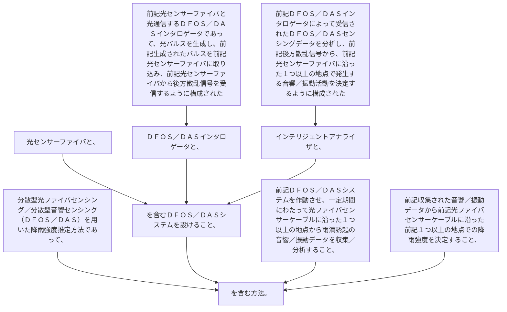

```mermaid
flowchart TD
A[分散型光ファイバセンシング／分散型音響センシング（ＤＦＯＳ／ＤＡＳ）を用いた降雨強度推定方法であって、]
B[光センサーファイバと、]
C[前記光センサーファイバと光通信するＤＦＯＳ／ＤＡＳインタロゲータであって、光パルスを生成し、前記生成されたパルスを前記光センサーファイバに取り込み、前記光センサーファイバから後方散乱信号を受信するように構成された]
D[ＤＦＯＳ／ＤＡＳインタロゲータと、]
E[前記ＤＦＯＳ／ＤＡＳインタロゲータによって受信されたＤＦＯＳ／ＤＡＳセンシングデータを分析し、前記後方散乱信号から、前記光センサーファイバに沿った１つ以上の地点で発生する音響／振動活動を決定するように構成された]
F[インテリジェントアナライザと、]
G[を含むＤＦＯＳ／ＤＡＳシステムを設けること、]
H[前記ＤＦＯＳ／ＤＡＳシステムを作動させ、一定期間にわたって光ファイバセンサーケーブルに沿った１つ以上の地点から雨滴誘起の音響／振動データを収集／分析すること、]
I[前記収集された音響／振動データから前記光ファイバセンサーケーブルに沿った前記１つ以上の地点での降雨強度を決定すること、]
J[を含む方法。]
A --> J
B --> G
C --> D
D --> G
E --> F
F --> G
G --> J
H --> J
I --> J
```