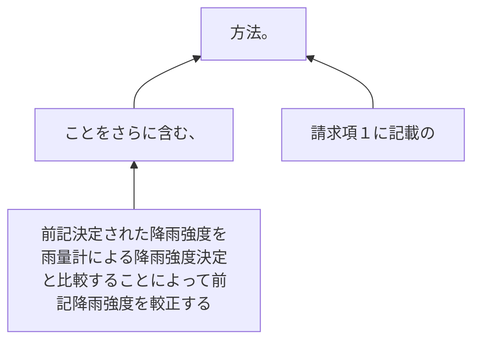

前記決定された降雨強度を雨量計による降雨強度決定と比較することによって前記降雨強度を較正することをさらに含む、請求項１に記載の方法。

```mermaid
flowchart BT
A[前記決定された降雨強度を雨量計による降雨強度決定と比較することによって前記降雨強度を較正する]
B[ことをさらに含む、]
C[請求項１に記載の]
D[方法。]
A --> B
B --> D
C --> D
```