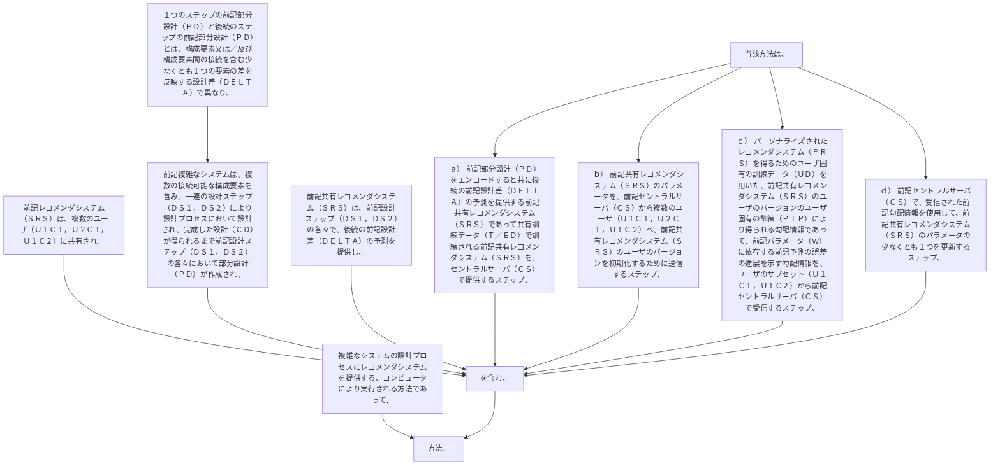

複雑なシステムの設計プロセスにレコメンダシステムを提供する、コンピュータにより実行される方法であって、
前記レコメンダシステム（ＳＲＳ）は、複数のユーザ（Ｕ１Ｃ１，Ｕ２Ｃ１，Ｕ１Ｃ２）に共有され、
前記複雑なシステムは、複数の接続可能な構成要素を含み、一連の設計ステップ（ＤＳ１，ＤＳ２）により設計プロセスにおいて設計され、完成した設計（ＣＤ）が得られるまで前記設計ステップ（ＤＳ１，ＤＳ２）の各々において部分設計（ＰＤ）が作成され、
１つのステップの前記部分設計（ＰＤ）と後続のステップの前記部分設計（ＰＤ）とは、構成要素又は／及び構成要素間の接続を含む少なくとも１つの要素の差を反映する設計差（ＤＥＬＴＡ）で異なり、
前記共有レコメンダシステム（ＳＲＳ）は、前記設計ステップ（ＤＳ１，ＤＳ２）の各々で、後続の前記設計差（ＤＥＬＴＡ）の予測を提供し、
当該方法は、
ａ）  前記部分設計（ＰＤ）をエンコードすると共に後続の前記設計差（ＤＥＬＴＡ）の予測を提供する前記共有レコメンダシステム（ＳＲＳ）であって共有訓練データ（Ｔ／ＥＤ）で訓練される前記共有レコメンダシステム（ＳＲＳ）を、セントラルサーバ（ＣＳ）で提供するステップ、
ｂ）  前記共有レコメンダシステム（ＳＲＳ）のパラメータを、前記セントラルサーバ（ＣＳ）から複数のユーザ（Ｕ１Ｃ１，Ｕ２Ｃ１，Ｕ１Ｃ２）へ、前記共有レコメンダシステム（ＳＲＳ）のユーザのバージョンを初期化するために送信するステップ、
ｃ）  パーソナライズされたレコメンダシステム（ＰＲＳ）を得るためのユーザ固有の訓練データ（ＵＤ）を用いた、前記共有レコメンダシステム（ＳＲＳ）のユーザのバージョンのユーザ固有の訓練（ＰＴＰ）により得られる勾配情報であって、前記パラメータ（ｗ）に依存する前記予測の誤差の進展を示す勾配情報を、ユーザのサブセット（Ｕ１Ｃ１，Ｕ１Ｃ２）から前記セントラルサーバ（ＣＳ）で受信するステップ、
ｄ）  前記セントラルサーバ（ＣＳ）で、受信された前記勾配情報を使用して、前記共有レコメンダシステム（ＳＲＳ）のパラメータの少なくとも１つを更新するステップ、
を含む、方法。
