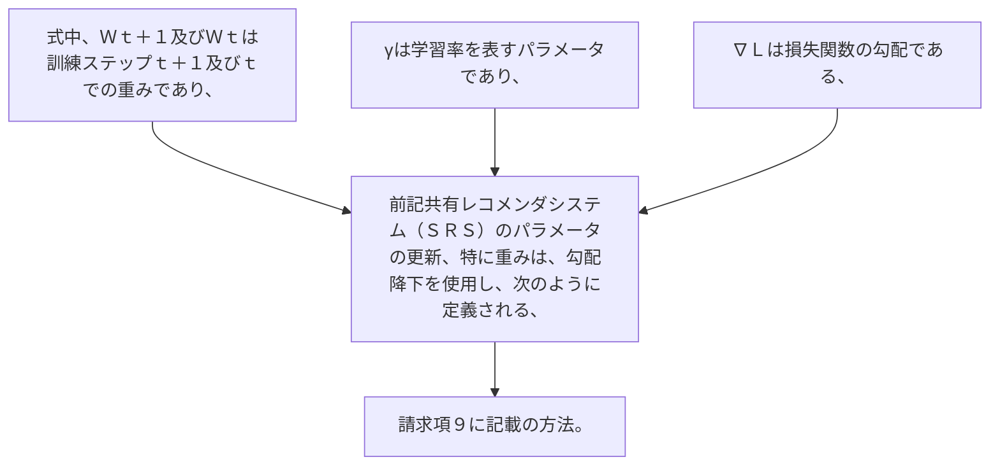

前記共有レコメンダシステム（ＳＲＳ）のパラメータの更新、特に重みは、勾配降下を使用し、次のように定義される、
式中、Ｗ
ｔ＋１
及びＷ
ｔ
は訓練ステップｔ＋１及びｔでの重みであり、γは学習率を表すパラメータであり、∇Ｌは損失関数の勾配である、請求項９に記載の方法。

```mermaid
flowchart TD
A[前記共有レコメンダシステム（ＳＲＳ）のパラメータの更新、特に重みは、勾配降下を使用し、次のように定義される、]
B[式中、Ｗｔ＋１及びＷｔは訓練ステップｔ＋１及びｔでの重みであり、]
C[γは学習率を表すパラメータであり、]
D[∇Ｌは損失関数の勾配である、]
E[請求項９に記載の方法。]
B --> A
C --> A
D --> A
A --> E
```