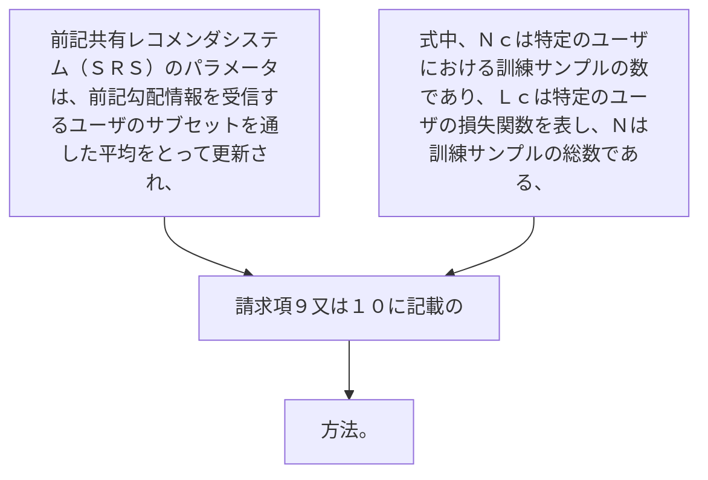

```mermaid
flowchart TD
A[前記共有レコメンダシステム（ＳＲＳ）のパラメータは、前記勾配情報を受信するユーザのサブセットを通した平均をとって更新され、]
B[式中、Ｎｃは特定のユーザにおける訓練サンプルの数であり、Ｌｃは特定のユーザの損失関数を表し、Ｎは訓練サンプルの総数である、]
C[請求項９又は１０に記載の]
D[方法。]
A --> C
B --> C
C --> D
```