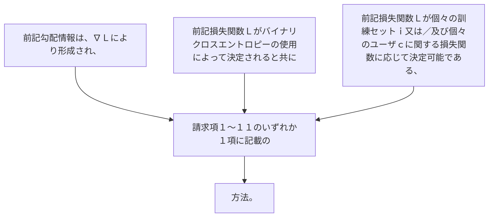

前記勾配情報は、∇Ｌにより形成され、前記損失関数Ｌがバイナリクロスエントロピーの使用によって決定されると共に前記損失関数Ｌが個々の訓練セットｉ又は／及び個々のユーザｃに関する損失関数に応じて決定可能である、請求項１～１１のいずれか１項に記載の方法。

```mermaid
flowchart TD
A[前記勾配情報は、∇Ｌにより形成され、]
B[前記損失関数Ｌがバイナリクロスエントロピーの使用によって決定されると共に]
C[前記損失関数Ｌが個々の訓練セットｉ又は／及び個々のユーザｃに関する損失関数に応じて決定可能である、]
D[請求項１～１１のいずれか１項に記載の]
E[方法。]
A --> D
B --> D
C --> D
D --> E
```