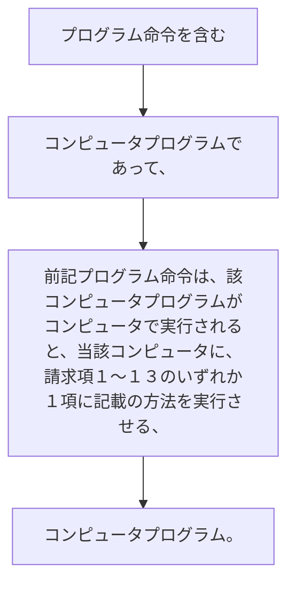

プログラム命令を含むコンピュータプログラムであって、前記プログラム命令は、該コンピュータプログラムがコンピュータで実行されると、当該コンピュータに、請求項１～１３のいずれか１項に記載の方法を実行させる、コンピュータプログラム。

```mermaid
flowchart TD
A[プログラム命令を含む]
B[コンピュータプログラムであって、]
C[前記プログラム命令は、該コンピュータプログラムがコンピュータで実行されると、当該コンピュータに、請求項１～１３のいずれか１項に記載の方法を実行させる、]
D[コンピュータプログラム。]
A --> B
B --> C
C --> D
```