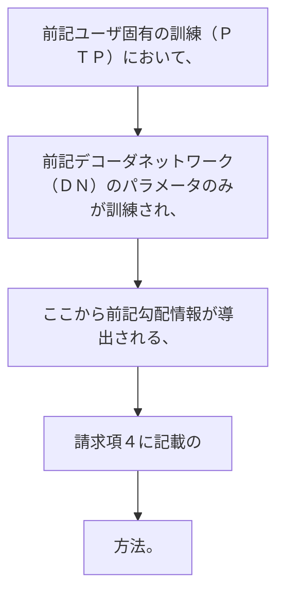

前記ユーザ固有の訓練（ＰＴＰ）において、前記デコーダネットワーク（ＤＮ）のパラメータのみが訓練され、ここから前記勾配情報が導出される、請求項４に記載の方法。

```mermaid
flowchart TD
A[前記ユーザ固有の訓練（ＰＴＰ）において、]
B[前記デコーダネットワーク（ＤＮ）のパラメータのみが訓練され、]
C[ここから前記勾配情報が導出される、]
D[請求項４に記載の]
E[方法。]
A --> B
B --> C
C --> D
D --> E
```