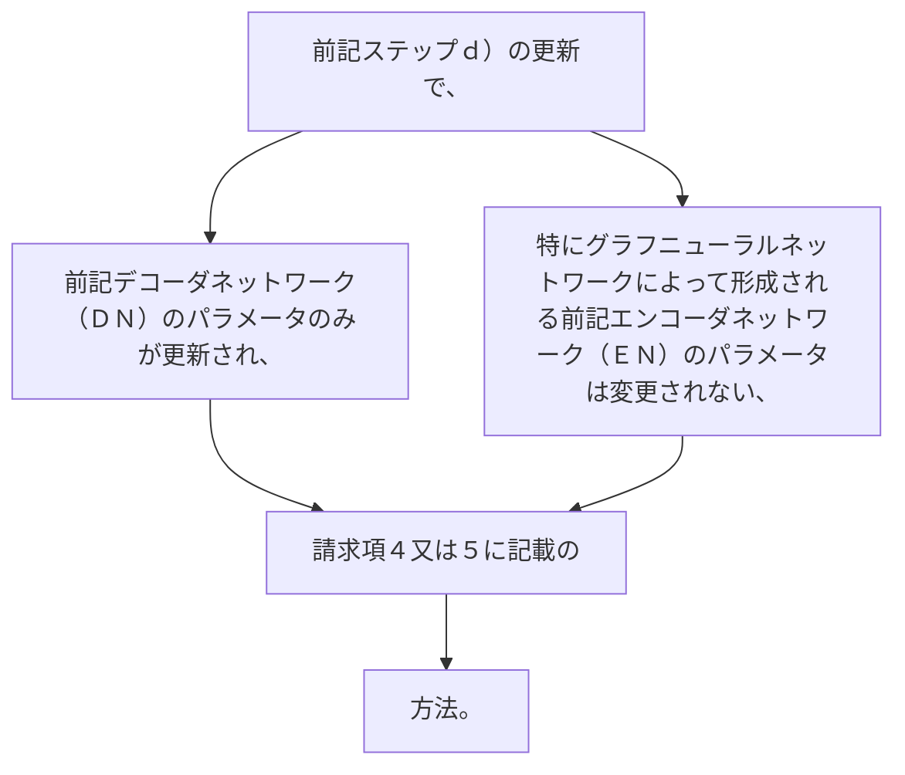

```mermaid
flowchart TD
A[前記ステップｄ）の更新で、]
B[前記デコーダネットワーク（ＤＮ）のパラメータのみが更新され、]
C[特にグラフニューラルネットワークによって形成される前記エンコーダネットワーク（ＥＮ）のパラメータは変更されない、]
D[請求項４又は５に記載の]
E[方法。]
A --> B
A --> C
B --> D
C --> D
D --> E
```