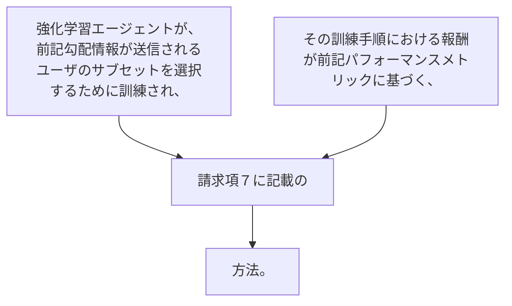

強化学習エージェントが、前記勾配情報が送信されるユーザのサブセットを選択するために訓練され、その訓練手順における報酬が前記パフォーマンスメトリックに基づく、請求項７に記載の方法。

```mermaid
flowchart TD
A[強化学習エージェントが、前記勾配情報が送信されるユーザのサブセットを選択するために訓練され、]
B[その訓練手順における報酬が前記パフォーマンスメトリックに基づく、]
C[請求項７に記載の]
D[方法。]
A --> C
B --> C
C --> D
```