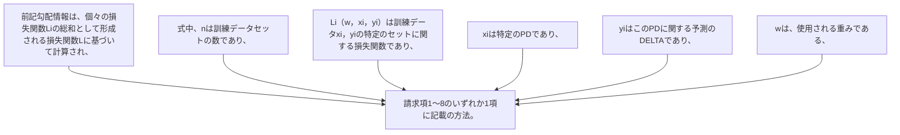

```mermaid
flowchart TD
A[前記勾配情報は、個々の損失関数Liの総和として形成される損失関数Lに基づいて計算され、]
B[式中、nは訓練データセットの数であり、]
C[Li（w，xi，yi）は訓練データxi，yiの特定のセットに関する損失関数であり、]
D[xiは特定のPDであり、]
E[yiはこのPDに関する予測のDELTAであり、]
F[wは、使用される重みである、]
G[請求項1～8のいずれか1項に記載の方法。]
A --> G
B --> G
C --> G
D --> G
E --> G
F --> G
```