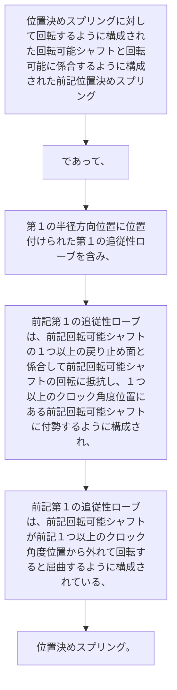

位置決めスプリングに対して回転するように構成された回転可能シャフトと回転可能に係合するように構成された前記位置決めスプリングであって、
第１の半径方向位置に位置付けられた第１の追従性ローブを含み、
前記第１の追従性ローブは、前記回転可能シャフトの１つ以上の戻り止め面と係合して前記回転可能シャフトの回転に抵抗し、１つ以上のクロック角度位置にある前記回転可能シャフトに付勢するように構成され、
前記第１の追従性ローブは、前記回転可能シャフトが前記１つ以上のクロック角度位置から外れて回転すると屈曲するように構成されている、位置決めスプリング。
