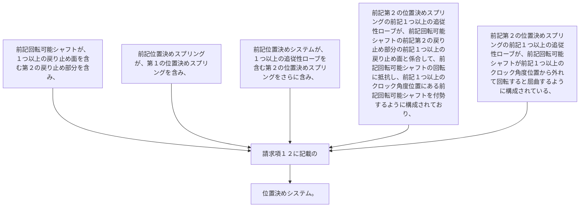

```mermaid
flowchart TD
N1[前記回転可能シャフトが、１つ以上の戻り止め面を含む第２の戻り止め部分を含み、]
N2[前記位置決めスプリングが、第１の位置決めスプリングを含み、]
N3[前記位置決めシステムが、１つ以上の追従性ローブを含む第２の位置決めスプリングをさらに含み、]
N4[前記第２の位置決めスプリングの前記１つ以上の追従性ローブが、前記回転可能シャフトの前記第２の戻り止め部分の前記１つ以上の戻り止め面と係合して、前記回転可能シャフトの回転に抵抗し、前記１つ以上のクロック角度位置にある前記回転可能シャフトを付勢するように構成されており、]
N5[前記第２の位置決めスプリングの前記１つ以上の追従性ローブが、前記回転可能シャフトが前記１つ以上のクロック角度位置から外れて回転すると屈曲するように構成されている、]
N6[請求項１２に記載の]
N7[位置決めシステム。]

N1 --> N6
N2 --> N6
N3 --> N6
N4 --> N6
N5 --> N6
N6 --> N7
```