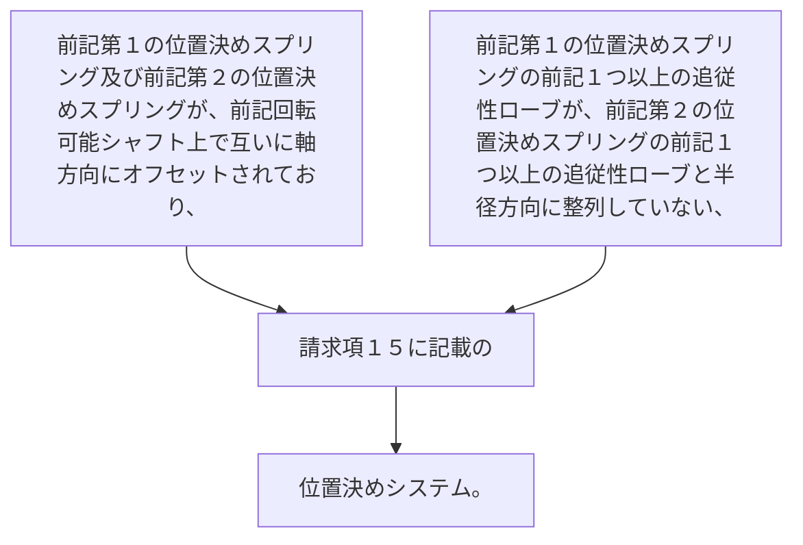

```mermaid
flowchart TD
A[前記第１の位置決めスプリング及び前記第２の位置決めスプリングが、前記回転可能シャフト上で互いに軸方向にオフセットされており、]
B[前記第１の位置決めスプリングの前記１つ以上の追従性ローブが、前記第２の位置決めスプリングの前記１つ以上の追従性ローブと半径方向に整列していない、]
C[請求項１５に記載の]
D[位置決めシステム。]
A --> C
B --> C
C --> D
```