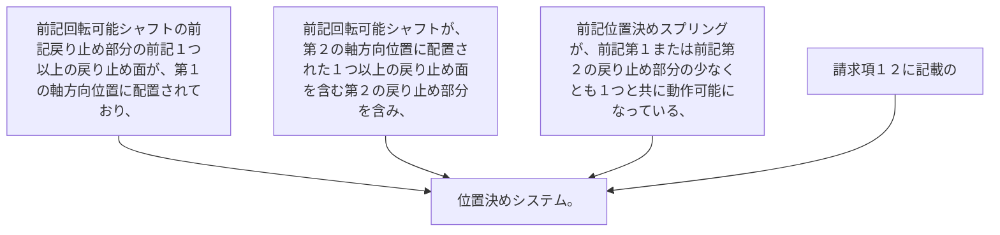

前記回転可能シャフトの前記戻り止め部分の前記１つ以上の戻り止め面が、第１の軸方向位置に配置されており、前記回転可能シャフトが、第２の軸方向位置に配置された１つ以上の戻り止め面を含む第２の戻り止め部分を含み、前記位置決めスプリングが、前記第１または前記第２の戻り止め部分の少なくとも１つと共に動作可能になっている、請求項１２に記載の位置決めシステム。

```mermaid
flowchart TD
A[前記回転可能シャフトの前記戻り止め部分の前記１つ以上の戻り止め面が、第１の軸方向位置に配置されており、]
B[前記回転可能シャフトが、第２の軸方向位置に配置された１つ以上の戻り止め面を含む第２の戻り止め部分を含み、]
C[前記位置決めスプリングが、前記第１または前記第２の戻り止め部分の少なくとも１つと共に動作可能になっている、]
D[請求項１２に記載の]
E[位置決めシステム。]
A --> E
B --> E
C --> E
D --> E
```