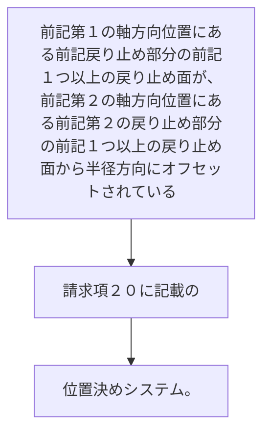

前記第１の軸方向位置にある前記戻り止め部分の前記１つ以上の戻り止め面が、前記第２の軸方向位置にある前記第２の戻り止め部分の前記１つ以上の戻り止め面から半径方向にオフセットされている、請求項２０に記載の位置決めシステム。

```mermaid
flowchart TD
A[前記第１の軸方向位置にある前記戻り止め部分の前記１つ以上の戻り止め面が、前記第２の軸方向位置にある前記第２の戻り止め部分の前記１つ以上の戻り止め面から半径方向にオフセットされている]
B[請求項２０に記載の]
C[位置決めシステム。]
A --> B
B --> C
```