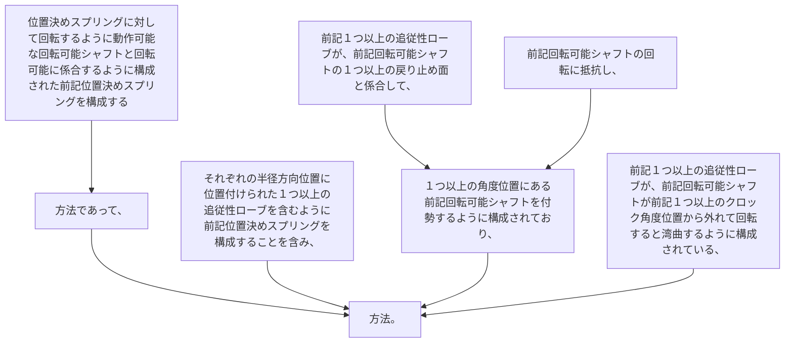

位置決めスプリングに対して回転するように動作可能な回転可能シャフトと回転可能に係合するように構成された前記位置決めスプリングを構成する方法であって、
それぞれの半径方向位置に位置付けられた１つ以上の追従性ローブを含むように前記位置決めスプリングを構成することを含み、
前記１つ以上の追従性ローブが、前記回転可能シャフトの１つ以上の戻り止め面と係合して、前記回転可能シャフトの回転に抵抗し、１つ以上の角度位置にある前記回転可能シャフトを付勢するように構成されており、
前記１つ以上の追従性ローブが、前記回転可能シャフトが前記１つ以上のクロック角度位置から外れて回転すると湾曲するように構成されている、方法。
