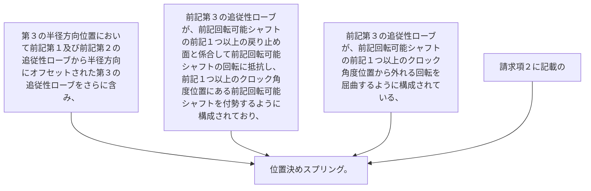

第３の半径方向位置において前記第１及び前記第２の追従性ローブから半径方向にオフセットされた第３の追従性ローブをさらに含み、
前記第３の追従性ローブが、前記回転可能シャフトの前記１つ以上の戻り止め面と係合して前記回転可能シャフトの回転に抵抗し、前記１つ以上のクロック角度位置にある前記回転可能シャフトを付勢するように構成されており、
前記第３の追従性ローブが、前記回転可能シャフトの前記１つ以上のクロック角度位置から外れる回転を屈曲するように構成されている、請求項２に記載の位置決めスプリング。
