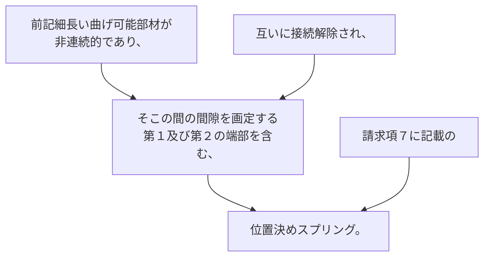

前記細長い曲げ可能部材が非連続的であり、互いに接続解除され、そこの間の間隙を画定する第１及び第２の端部を含む、請求項７に記載の位置決めスプリング。

```mermaid
flowchart TD
A[前記細長い曲げ可能部材が非連続的であり、]
B[互いに接続解除され、]
C[そこの間の間隙を画定する第１及び第２の端部を含む、]
D[請求項７に記載の]
E[位置決めスプリング。]

A --> C
B --> C
C --> E
D --> E
```