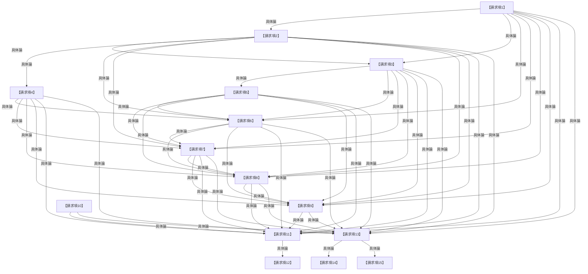

解析対象の特許請求項を解析し、ご指定の形式に従ってMermaid記法で出力します。

```mermaid
flowchart TB
A[【請求項1】]
B[【請求項2】]
C[【請求項3】]
D[【請求項4】]
E[【請求項5】]
F[【請求項6】]
G[【請求項7】]
H[【請求項8】]
I[【請求項9】]
J[【請求項10】]
K[【請求項11】]
L[【請求項12】]
M[【請求項13】]
N[【請求項14】]
O[【請求項15】]

A --具体論--> B
A --具体論--> C
B --具体論--> C
B --具体論--> D
C --具体論--> E
A --具体論--> F
B --具体論--> F
C --具体論--> F
D --具体論--> F
E --具体論--> F
A --具体論--> G
B --具体論--> G
C --具体論--> G
D --具体論--> G
E --具体論--> G
F --具体論--> G
A --具体論--> H
B --具体論--> H
C --具体論--> H
D --具体論--> H
E --具体論--> H
F --具体論--> H
G --具体論--> H
A --具体論--> I
B --具体論--> I
C --具体論--> I
D --具体論--> I
E --具体論--> I
F --具体論--> I
G --具体論--> I
H --具体論--> I
A --具体論--> K
B --具体論--> K
C --具体論--> K
D --具体論--> K
E --具体論--> K
F --具体論--> K
G --具体論--> K
H --具体論--> K
I --具体論--> K
J --具体論--> K
K --具体論--> L
A --具体論--> M
B --具体論--> M
C --具体論--> M
D --具体論--> M
E --具体論--> M
F --具体論--> M
G --具体論--> M
H --具体論--> M
I --具体論--> M
J --具体論--> M
M --具体論--> N
M --具体論--> O
```
