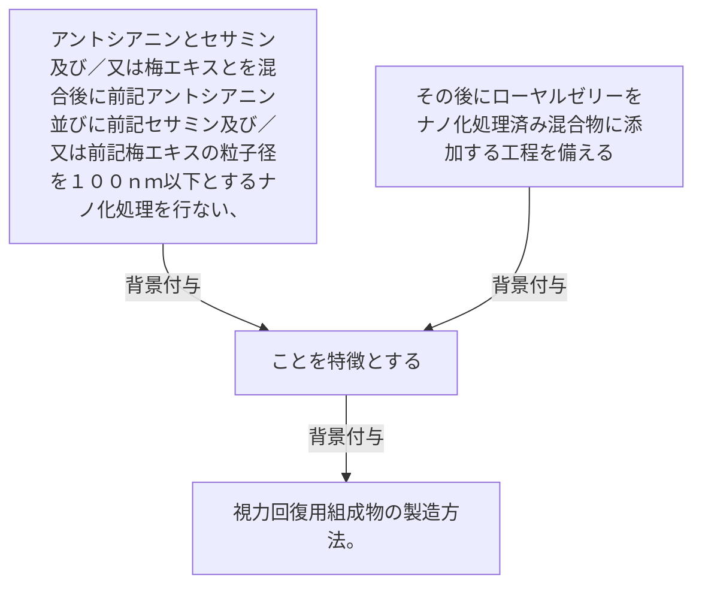

```mermaid
flowchart TB
A[アントシアニンとセサミン及び／又は梅エキスとを混合後に前記アントシアニン並びに前記セサミン及び／又は前記梅エキスの粒子径を１００ｎｍ以下とするナノ化処理を行ない、]
B[その後にローヤルゼリーをナノ化処理済み混合物に添加する工程を備える]
C[ことを特徴とする]
D[視力回復用組成物の製造方法。]
A --背景付与--> C
B --背景付与--> C
C --背景付与--> D
```