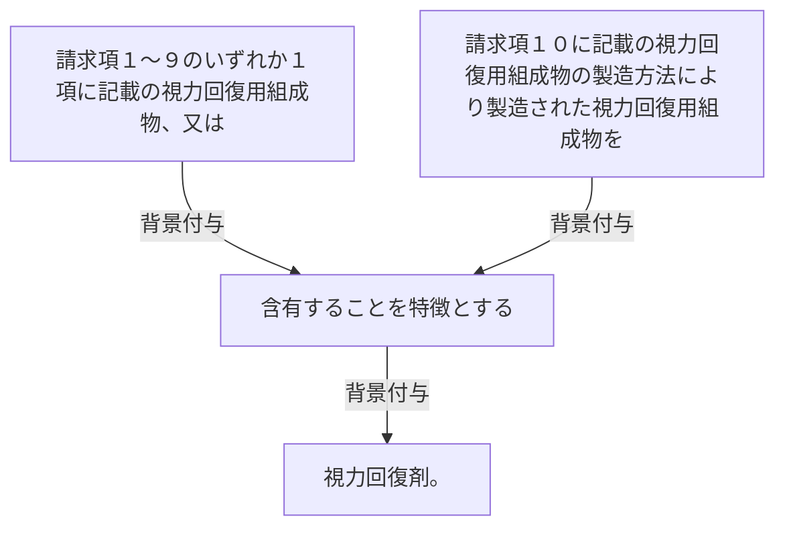

請求項１～９のいずれか１項に記載の視力回復用組成物又は請求項１０に記載の視力回復用組成物の製造方法により製造された視力回復用組成物を含有することを特徴とする視力回復剤。

```mermaid
flowchart TB
A[請求項１～９のいずれか１項に記載の視力回復用組成物、又は]
B[請求項１０に記載の視力回復用組成物の製造方法により製造された視力回復用組成物を]
C[含有することを特徴とする]
D[視力回復剤。]

A --背景付与--> C
B --背景付与--> C
C --背景付与--> D
```