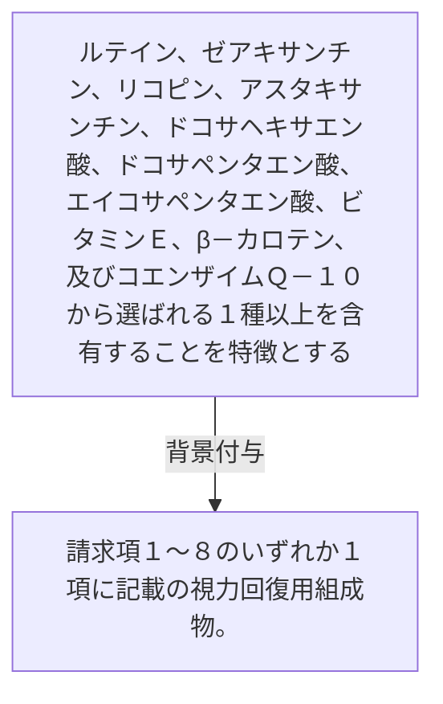

ルテイン、ゼアキサンチン、リコピン、アスタキサンチン、ドコサヘキサエン酸、ドコサペンタエン酸、エイコサペンタエン酸、ビタミンＥ、β－カロテン、及びコエンザイムＱ－１０から選ばれる１種以上を含有することを特徴とする請求項１～８のいずれか１項に記載の視力回復用組成物。

```mermaid
flowchart TB
A[ルテイン、ゼアキサンチン、リコピン、アスタキサンチン、ドコサヘキサエン酸、ドコサペンタエン酸、エイコサペンタエン酸、ビタミンＥ、β－カロテン、及びコエンザイムＱ－１０から選ばれる１種以上を含有することを特徴とする]
B[請求項１～８のいずれか１項に記載の視力回復用組成物。]
A --背景付与--> B
```