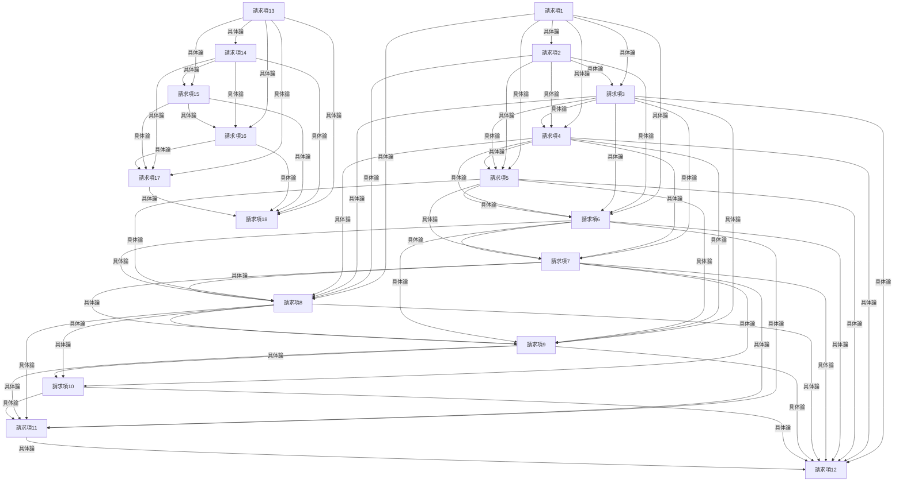

解析対象の特許請求項について、ご指定の形式および入力例のルール（参照先から参照元への矢印）に従って、Mermaid記法による引用関係のフローチャートを出力します。

```mermaid
flowchart TB
A[請求項1]
B[請求項2]
C[請求項3]
D[請求項4]
E[請求項5]
F[請求項6]
G[請求項7]
H[請求項8]
I[請求項9]
J[請求項10]
K[請求項11]
L[請求項12]
M[請求項13]
N[請求項14]
O[請求項15]
P[請求項16]
Q[請求項17]
R[請求項18]

A --具体論--> B
A --具体論--> C
B --具体論--> C
A --具体論--> D
B --具体論--> D
C --具体論--> D
A --具体論--> E
B --具体論--> E
C --具体論--> E
D --具体論--> E
A --具体論--> F
B --具体論--> F
C --具体論--> F
D --具体論--> F
E --具体論--> F
C --具体論--> G
D --具体論--> G
E --具体論--> G
F --具体論--> G
A --具体論--> H
B --具体論--> H
C --具体論--> H
D --具体論--> H
E --具体論--> H
F --具体論--> H
G --具体論--> H
C --具体論--> I
D --具体論--> I
E --具体論--> I
F --具体論--> I
G --具体論--> I
H --具体論--> I
G --具体論--> J
H --具体論--> J
I --具体論--> J
F --具体論--> K
G --具体論--> K
H --具体論--> K
I --具体論--> K
J --具体論--> K
C --具体論--> L
D --具体論--> L
E --具体論--> L
F --具体論--> L
G --具体論--> L
H --具体論--> L
I --具体論--> L
J --具体論--> L
K --具体論--> L
M --具体論--> N
M --具体論--> O
N --具体論--> O
M --具体論--> P
N --具体論--> P
O --具体論--> P
M --具体論--> Q
N --具体論--> Q
O --具体論--> Q
P --具体論--> Q
M --具体論--> R
N --具体論--> R
O --具体論--> R
P --具体論--> R
Q --具体論--> R
```
