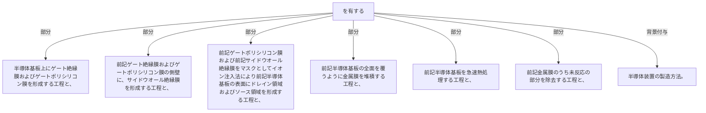

半導体基板上にゲート絶縁膜およびゲートポリシリコン膜を形成する工程と、前記ゲート絶縁膜およびゲートポリシリコン膜の側壁に、サイドウオール絶縁膜を形成する工程と、
前記ゲートポリシリコン膜および前記サイドウオール絶縁膜をマスクとしてイオン注入法により前記半導体基板の表面にドレイン領域およびソース領域を形成する工程と、
前記半導体基板の全面を覆うように金属膜を堆積する工程と、前記半導体基板を急速熱処理する工程と、前記金属膜のうち未反応の部分を除去する工程と、
を有する半導体装置の製造方法。

