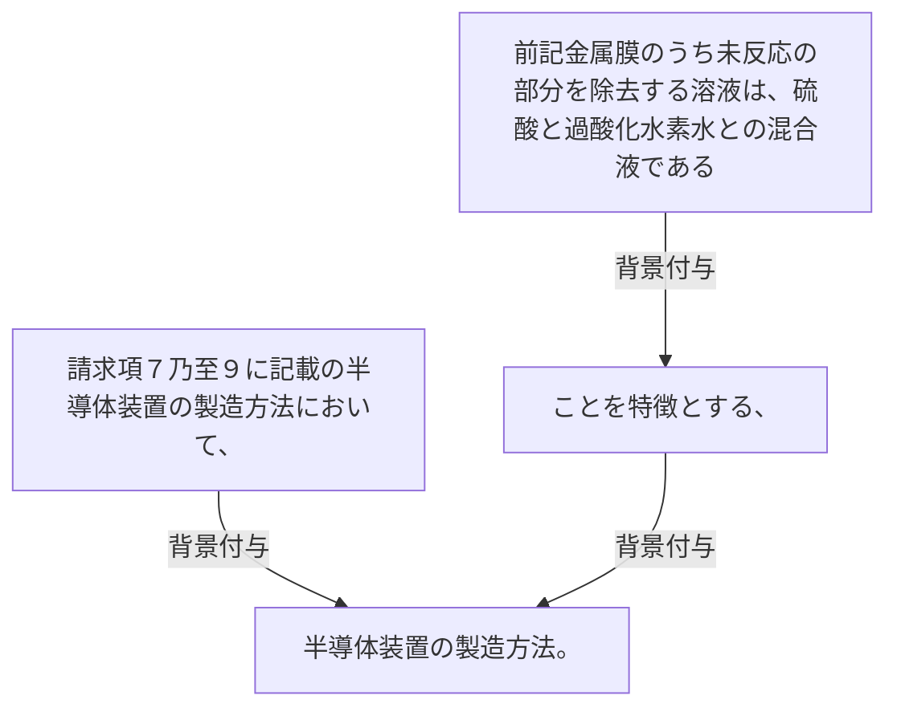

請求項７乃至９に記載の半導体装置の製造方法において、前記金属膜のうち未反応の部分を除去する溶液は、硫酸と過酸化水素水との混合液であることを特徴とする、半導体装置の製造方法。

```mermaid
flowchart TB
A[請求項７乃至９に記載の半導体装置の製造方法において、]
B[前記金属膜のうち未反応の部分を除去する溶液は、硫酸と過酸化水素水との混合液である]
C[ことを特徴とする、]
D[半導体装置の製造方法。]
A --背景付与--> D
B --背景付与--> C
C --背景付与--> D
```