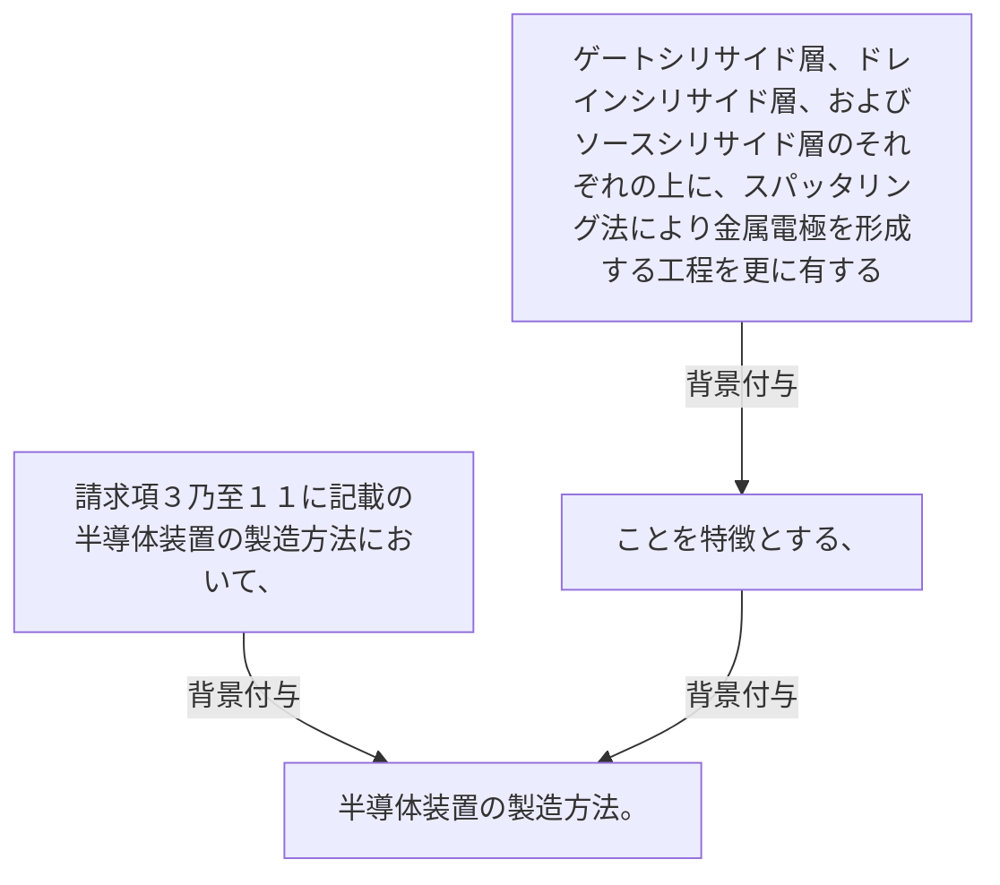

```mermaid
flowchart TB
A[請求項３乃至１１に記載の半導体装置の製造方法において、]
B[ゲートシリサイド層、ドレインシリサイド層、およびソースシリサイド層のそれぞれの上に、スパッタリング法により金属電極を形成する工程を更に有する]
C[ことを特徴とする、]
D[半導体装置の製造方法。]
A --背景付与--> D
B --背景付与--> C
C --背景付与--> D
```