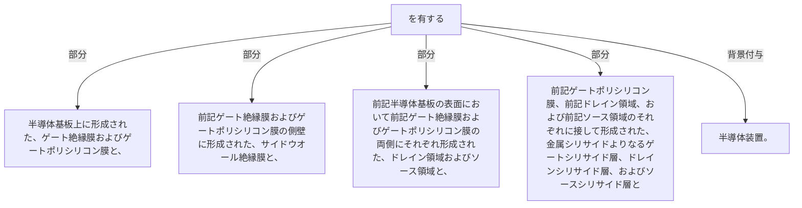

```mermaid
flowchart TB
A[半導体基板上に形成された、ゲート絶縁膜およびゲートポリシリコン膜と、]
B[前記ゲート絶縁膜およびゲートポリシリコン膜の側壁に形成された、サイドウオール絶縁膜と、]
C[前記半導体基板の表面において前記ゲート絶縁膜およびゲートポリシリコン膜の両側にそれぞれ形成された、ドレイン領域およびソース領域と、]
D[前記ゲートポリシリコン膜、前記ドレイン領域、および前記ソース領域のそれぞれに接して形成された、金属シリサイドよりなるゲートシリサイド層、ドレインシリサイド層、およびソースシリサイド層と]
E[を有する]
F[半導体装置。]
E --部分--> A
E --部分--> B
E --部分--> C
E --部分--> D
E --背景付与--> F
```