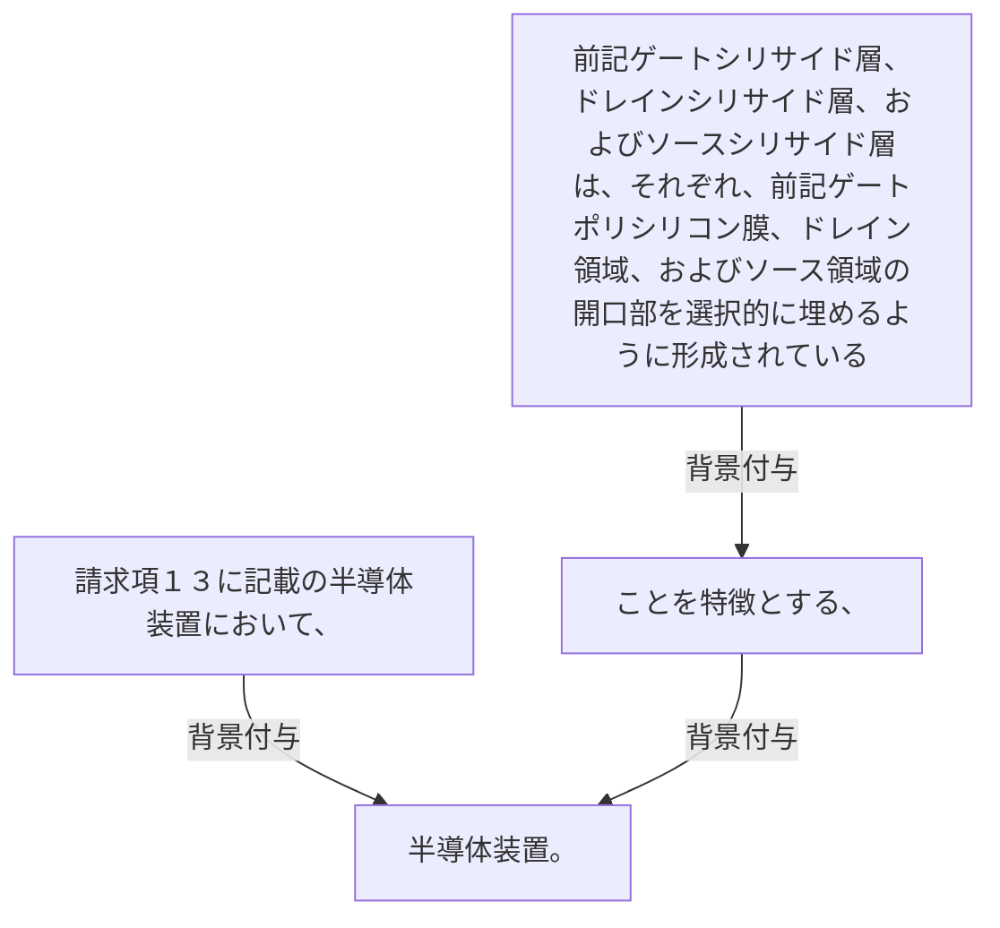

請求項１３に記載の半導体装置において、
前記ゲートシリサイド層、ドレインシリサイド層、およびソースシリサイド層は、それぞれ、前記ゲートポリシリコン膜、ドレイン領域、およびソース領域の開口部を選択的に埋めるように形成されていることを特徴とする、半導体装置。

```mermaid
flowchart TB
A[請求項１３に記載の半導体装置において、]
B[前記ゲートシリサイド層、ドレインシリサイド層、およびソースシリサイド層は、それぞれ、前記ゲートポリシリコン膜、ドレイン領域、およびソース領域の開口部を選択的に埋めるように形成されている]
C[ことを特徴とする、]
D[半導体装置。]
A --背景付与--> D
B --背景付与--> C
C --背景付与--> D
```