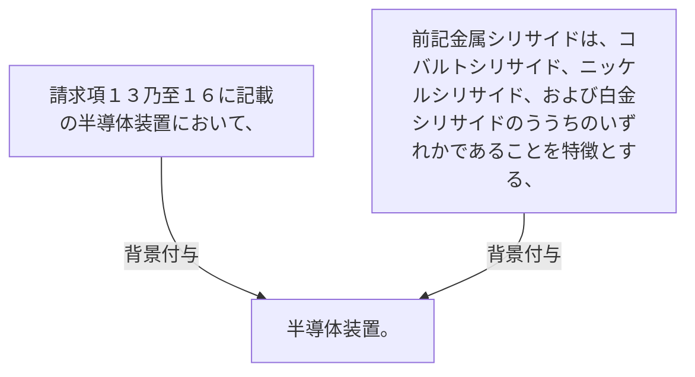

請求項１３乃至１６に記載の半導体装置において、
前記金属シリサイドは、コバルトシリサイド、ニッケルシリサイド、および白金シリサイドのううちのいずれかであることを特徴とする、半導体装置。

```mermaid
flowchart TB
A[請求項１３乃至１６に記載の半導体装置において、]
B[前記金属シリサイドは、コバルトシリサイド、ニッケルシリサイド、および白金シリサイドのううちのいずれかであることを特徴とする、]
C[半導体装置。]
A --背景付与--> C
B --背景付与--> C
```