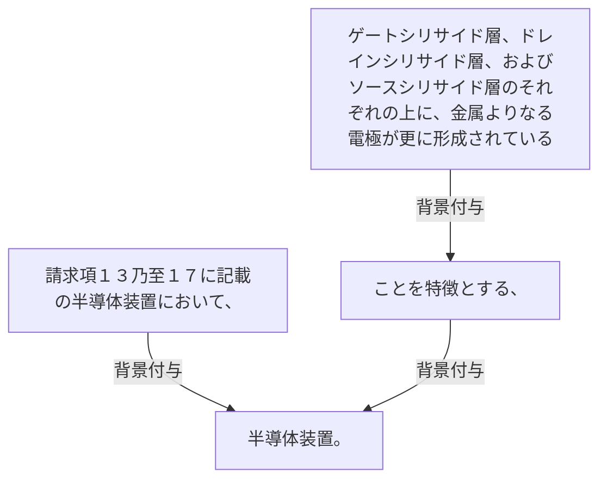

請求項１３乃至１７に記載の半導体装置において、
ゲートシリサイド層、ドレインシリサイド層、およびソースシリサイド層のそれぞれの上に、金属よりなる電極が更に形成されていることを特徴とする、半導体装置。

```mermaid
flowchart TB
A[請求項１３乃至１７に記載の半導体装置において、]
B[ゲートシリサイド層、ドレインシリサイド層、およびソースシリサイド層のそれぞれの上に、金属よりなる電極が更に形成されている]
C[ことを特徴とする、]
D[半導体装置。]
A --背景付与--> D
B --背景付与--> C
C --背景付与--> D
```