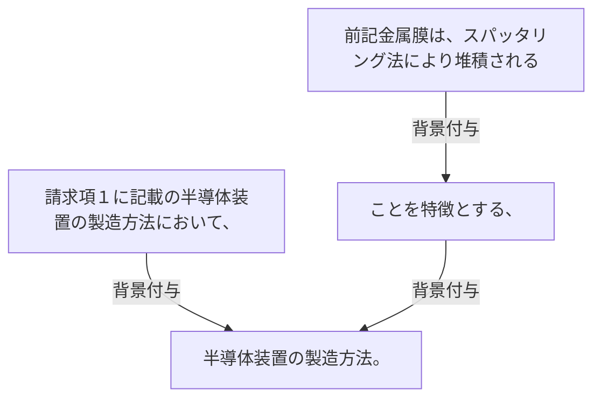

請求項１に記載の半導体装置の製造方法において、
前記金属膜は、スパッタリング法により堆積されることを特徴とする、半導体装置の製造方法。

```mermaid
flowchart TB
A[請求項１に記載の半導体装置の製造方法において、]
B[前記金属膜は、スパッタリング法により堆積される]
C[ことを特徴とする、]
D[半導体装置の製造方法。]
A --背景付与--> D
B --背景付与--> C
C --背景付与--> D
```