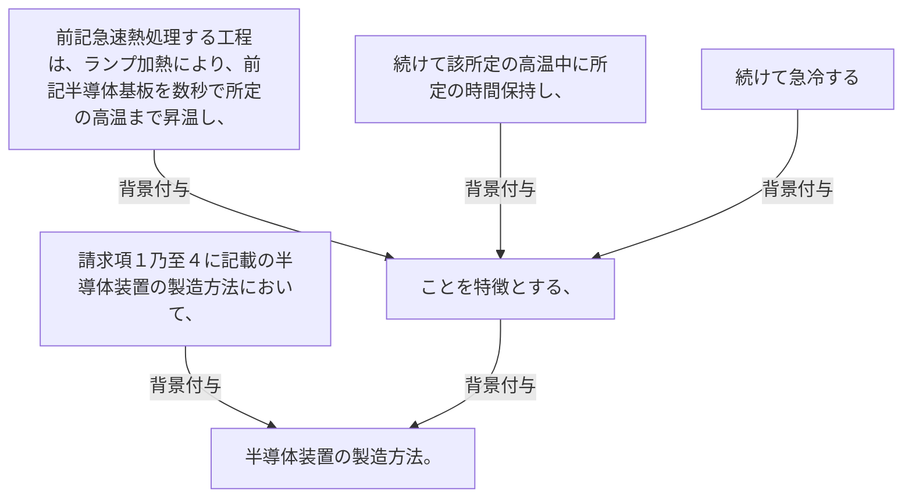

請求項１乃至４に記載の半導体装置の製造方法において、
前記急速熱処理する工程は、ランプ加熱により、前記半導体基板を数秒で所定の高温まで昇温し、続けて該所定の高温中に所定の時間保持し、続けて急冷することを特徴とする、半導体装置の製造方法。

```mermaid
flowchart TB
A[請求項１乃至４に記載の半導体装置の製造方法において、]
B[前記急速熱処理する工程は、ランプ加熱により、前記半導体基板を数秒で所定の高温まで昇温し、]
C[続けて該所定の高温中に所定の時間保持し、]
D[続けて急冷する]
E[ことを特徴とする、]
F[半導体装置の製造方法。]
A --背景付与--> F
B --背景付与--> E
C --背景付与--> E
D --背景付与--> E
E --背景付与--> F
```