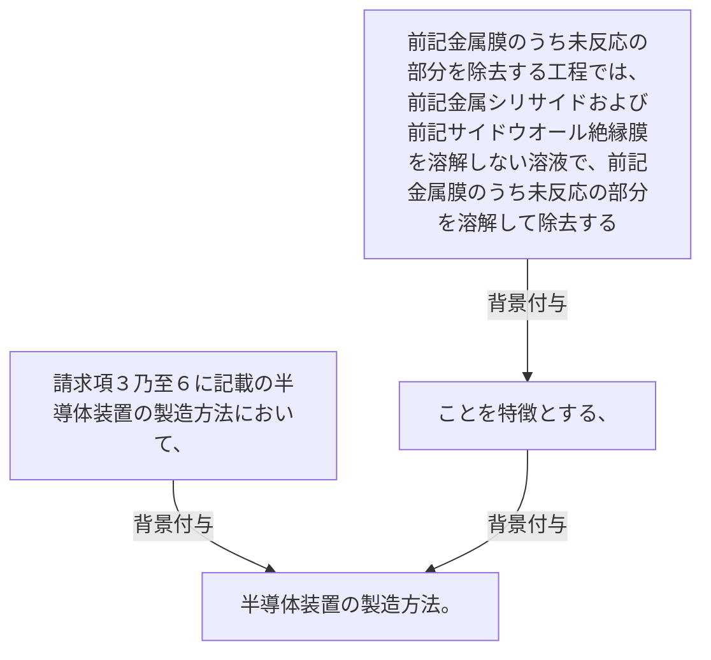

```mermaid
flowchart TB
A[請求項３乃至６に記載の半導体装置の製造方法において、]
B[前記金属膜のうち未反応の部分を除去する工程では、前記金属シリサイドおよび前記サイドウオール絶縁膜を溶解しない溶液で、前記金属膜のうち未反応の部分を溶解して除去する]
C[ことを特徴とする、]
D[半導体装置の製造方法。]
A --背景付与--> D
B --背景付与--> C
C --背景付与--> D
```