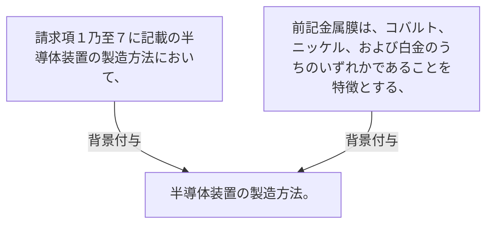

請求項１乃至７に記載の半導体装置の製造方法において、前記金属膜は、コバルト、ニッケル、および白金のうちのいずれかであることを特徴とする、半導体装置の製造方法。

```mermaid
flowchart TB
A[請求項１乃至７に記載の半導体装置の製造方法において、]
B[前記金属膜は、コバルト、ニッケル、および白金のうちのいずれかであることを特徴とする、]
C[半導体装置の製造方法。]
A --背景付与--> C
B --背景付与--> C
```