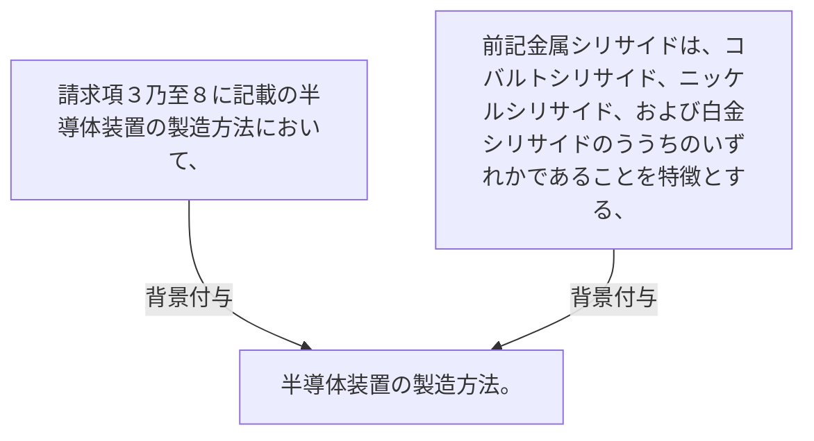

請求項３乃至８に記載の半導体装置の製造方法において、前記金属シリサイドは、コバルトシリサイド、ニッケルシリサイド、および白金シリサイドのううちのいずれかであることを特徴とする、半導体装置の製造方法。

```mermaid
flowchart TB
A[請求項３乃至８に記載の半導体装置の製造方法において、]
B[前記金属シリサイドは、コバルトシリサイド、ニッケルシリサイド、および白金シリサイドのううちのいずれかであることを特徴とする、]
C[半導体装置の製造方法。]
A --背景付与--> C
B --背景付与--> C
```