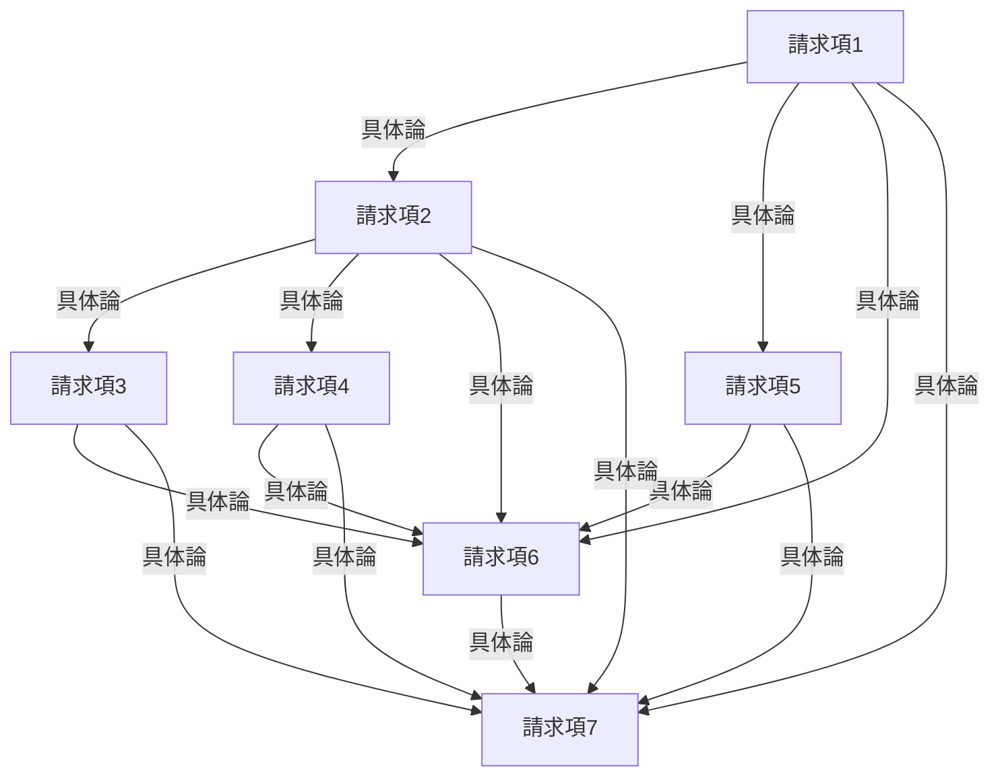

解析対象の特許請求項を解析し、ご指定のルールおよび出力例の形式（被引用請求項から引用請求項への矢印）に従って作成したMermaidコードは以下の通りです。

```mermaid
flowchart TB
A[請求項1]
B[請求項2]
C[請求項3]
D[請求項4]
E[請求項5]
F[請求項6]
G[請求項7]
A --具体論--> B
B --具体論--> C
B --具体論--> D
A --具体論--> E
A --具体論--> F
B --具体論--> F
C --具体論--> F
D --具体論--> F
E --具体論--> F
A --具体論--> G
B --具体論--> G
C --具体論--> G
D --具体論--> G
E --具体論--> G
F --具体論--> G
```
