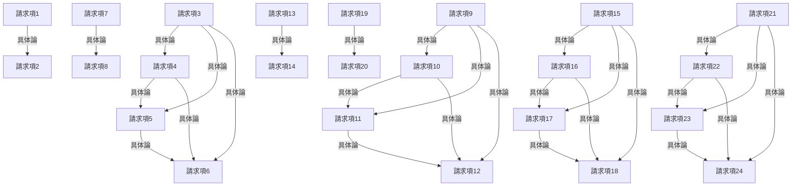

解析対象の特許請求項を解析し、ご提示いただいた出力例の規則（独立形式請求項をルートノードとし、被引用請求項から引用形式請求項へ矢印を引く構造）に従って作成したMermaid記法は以下の通りです。

```mermaid
flowchart TB
A[請求項1]
B[請求項2]
C[請求項3]
D[請求項4]
E[請求項5]
F[請求項6]
G[請求項7]
H[請求項8]
I[請求項9]
J[請求項10]
K[請求項11]
L[請求項12]
M[請求項13]
N[請求項14]
O[請求項15]
P[請求項16]
Q[請求項17]
R[請求項18]
S[請求項19]
T[請求項20]
U[請求項21]
V[請求項22]
W[請求項23]
X[請求項24]
A --具体論--> B
C --具体論--> D
C --具体論--> E
D --具体論--> E
C --具体論--> F
D --具体論--> F
E --具体論--> F
G --具体論--> H
I --具体論--> J
I --具体論--> K
J --具体論--> K
I --具体論--> L
J --具体論--> L
K --具体論--> L
M --具体論--> N
O --具体論--> P
O --具体論--> Q
P --具体論--> Q
O --具体論--> R
P --具体論--> R
Q --具体論--> R
S --具体論--> T
U --具体論--> V
U --具体論--> W
V --具体論--> W
U --具体論--> X
V --具体論--> X
W --具体論--> X
```
