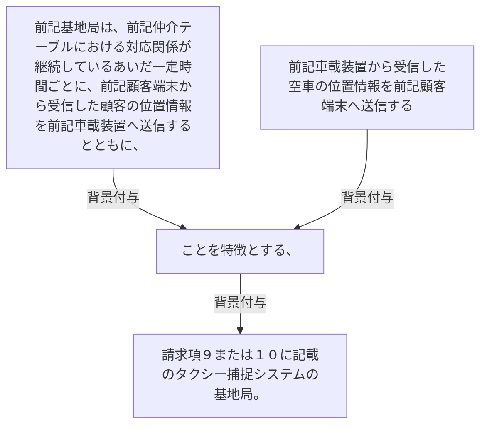

前記基地局は、前記仲介テーブルにおける対応関係が継続しているあいだ一定時間ごとに、前記顧客端末から受信した顧客の位置情報を前記車載装置へ送信するとともに、前記車載装置から受信した空車の位置情報を前記顧客端末へ送信することを特徴とする、請求項９または１０に記載のタクシー捕捉システムの基地局。

```mermaid
flowchart TB
A[前記基地局は、前記仲介テーブルにおける対応関係が継続しているあいだ一定時間ごとに、前記顧客端末から受信した顧客の位置情報を前記車載装置へ送信するとともに、]
B[前記車載装置から受信した空車の位置情報を前記顧客端末へ送信する]
C[ことを特徴とする、]
D[請求項９または１０に記載のタクシー捕捉システムの基地局。]
A --背景付与--> C
B --背景付与--> C
C --背景付与--> D
```