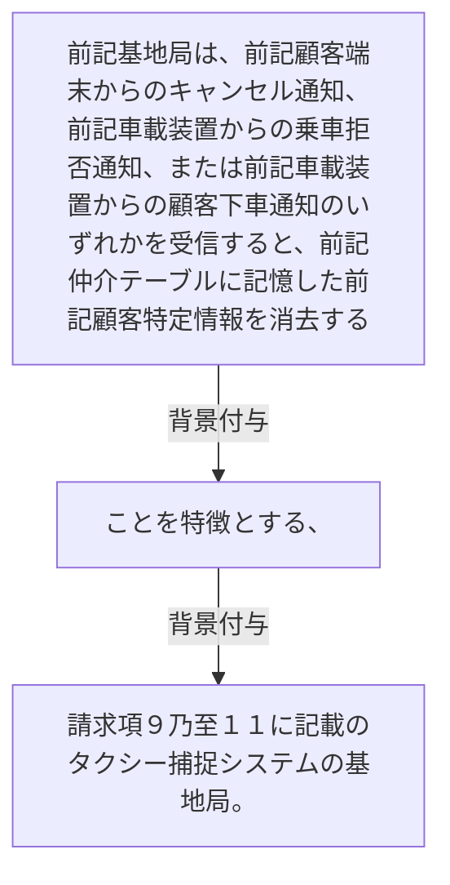

前記基地局は、前記顧客端末からのキャンセル通知、前記車載装置からの乗車拒否通知、または前記車載装置からの顧客下車通知のいずれかを受信すると、前記仲介テーブルに記憶した前記顧客特定情報を消去することを特徴とする、請求項９乃至１１に記載のタクシー捕捉システムの基地局。

```mermaid
flowchart TB
A[前記基地局は、前記顧客端末からのキャンセル通知、前記車載装置からの乗車拒否通知、または前記車載装置からの顧客下車通知のいずれかを受信すると、前記仲介テーブルに記憶した前記顧客特定情報を消去する]
B[ことを特徴とする、]
C[請求項９乃至１１に記載のタクシー捕捉システムの基地局。]
A --背景付与--> B
B --背景付与--> C
```