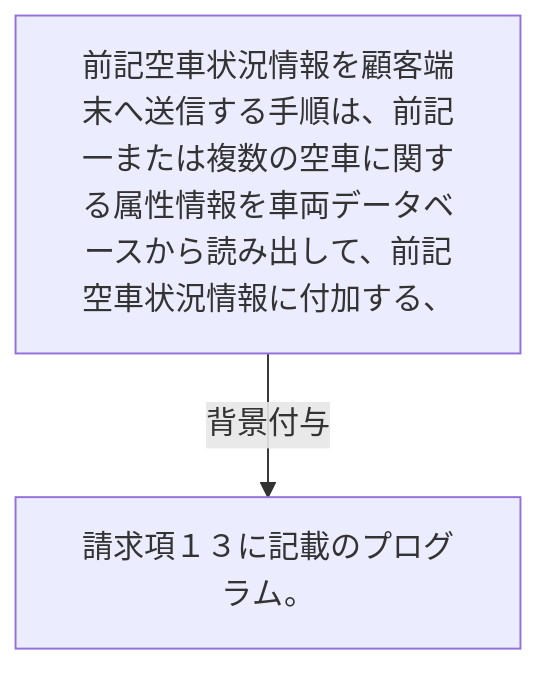

前記空車状況情報を顧客端末へ送信する手順は、前記一または複数の空車に
関する属性情報を車両データベースから読み出して、前記空車状況情報に付加する、請求項１３に記載のプログラム。

```mermaid
flowchart TB
A[前記空車状況情報を顧客端末へ送信する手順は、前記一または複数の空車に関する属性情報を車両データベースから読み出して、前記空車状況情報に付加する、]
B[請求項１３に記載のプログラム。]
A --背景付与--> B
```