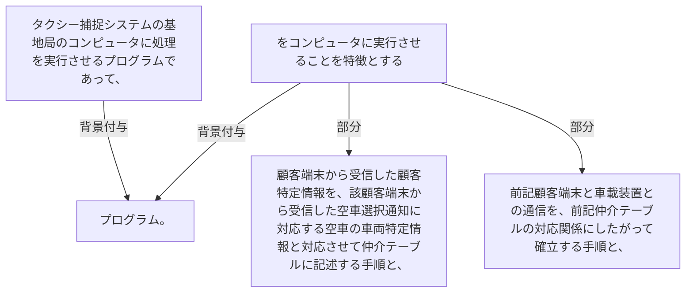

タクシー捕捉システムの基地局のコンピュータに処理を実行させるプログラムであって、
顧客端末から受信した顧客特定情報を、該顧客端末から受信した空車選択通知に対応する空車の車両特定情報と対応させて仲介テーブルに記述する手順と、
前記顧客端末と車載装置との通信を、前記仲介テーブルの対応関係にしたがって確立する手順と、
をコンピュータに実行させることを特徴とするプログラム。

```mermaid
flowchart TB
A[タクシー捕捉システムの基地局のコンピュータに処理を実行させるプログラムであって、]
B[顧客端末から受信した顧客特定情報を、該顧客端末から受信した空車選択通知に対応する空車の車両特定情報と対応させて仲介テーブルに記述する手順と、]
C[前記顧客端末と車載装置との通信を、前記仲介テーブルの対応関係にしたがって確立する手順と、]
D[をコンピュータに実行させることを特徴とする]
E[プログラム。]
A --背景付与--> E
D --部分--> B
D --部分--> C
D --背景付与--> E
```