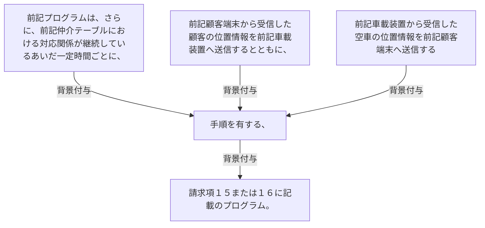

前記プログラムは、さらに、前記仲介テーブルにおける対応関係が継続しているあいだ一定時間ごとに、前記顧客端末から受信した顧客の位置情報を前記車載装置へ送信するとともに、前記車載装置から受信した空車の位置情報を前記顧客端末へ送信する手順を有する、請求項１５または１６に記載のプログラム。

```mermaid
flowchart TB
A[前記プログラムは、さらに、前記仲介テーブルにおける対応関係が継続しているあいだ一定時間ごとに、]
B[前記顧客端末から受信した顧客の位置情報を前記車載装置へ送信するとともに、]
C[前記車載装置から受信した空車の位置情報を前記顧客端末へ送信する]
D[手順を有する、]
E[請求項１５または１６に記載のプログラム。]
A --背景付与--> D
B --背景付与--> D
C --背景付与--> D
D --背景付与--> E
```