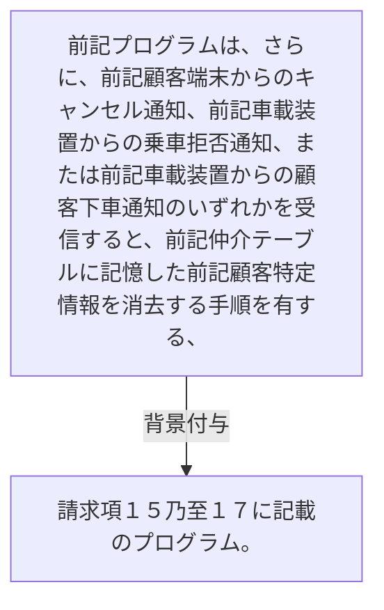

前記プログラムは、さらに、前記顧客端末からのキャンセル通知、前記車載装置からの乗車拒否通知、または前記車載装置からの顧客下車通知のいずれかを受信すると、前記仲介テーブルに記憶した前記顧客特定情報を消去する手順を有する、請求項１５乃至１７に記載のプログラム。

```mermaid
flowchart TB
A[前記プログラムは、さらに、前記顧客端末からのキャンセル通知、前記車載装置からの乗車拒否通知、または前記車載装置からの顧客下車通知のいずれかを受信すると、前記仲介テーブルに記憶した前記顧客特定情報を消去する手順を有する、]
B[請求項１５乃至１７に記載のプログラム。]
A --背景付与--> B
```