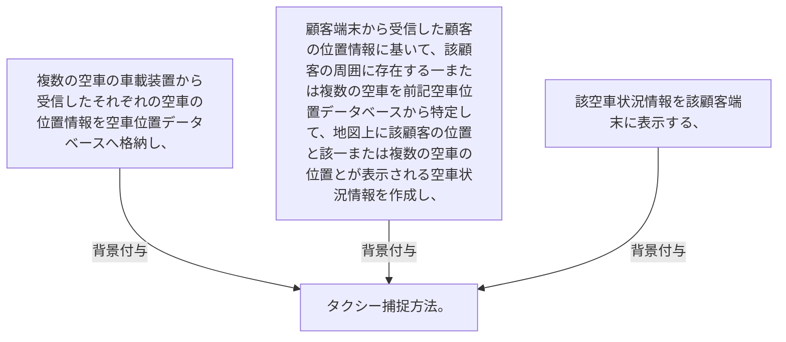

```mermaid
flowchart TB
A[複数の空車の車載装置から受信したそれぞれの空車の位置情報を空車位置データベースへ格納し、]
B[顧客端末から受信した顧客の位置情報に基いて、該顧客の周囲に存在する一または複数の空車を前記空車位置データベースから特定して、地図上に該顧客の位置と該一または複数の空車の位置とが表示される空車状況情報を作成し、]
C[該空車状況情報を該顧客端末に表示する、]
D[タクシー捕捉方法。]
A --背景付与--> D
B --背景付与--> D
C --背景付与--> D
```