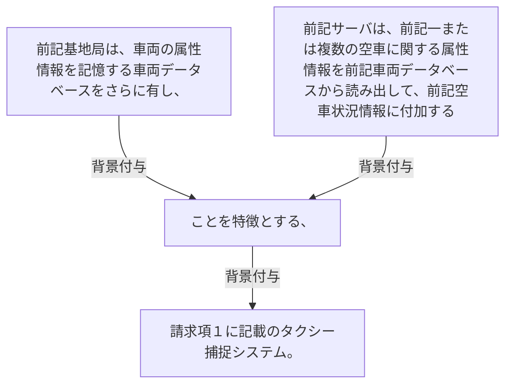

```mermaid
flowchart TB
A[前記基地局は、車両の属性情報を記憶する車両データベースをさらに有し、]
B[前記サーバは、前記一または複数の空車に関する属性情報を前記車両データベースから読み出して、前記空車状況情報に付加する]
C[ことを特徴とする、]
D[請求項１に記載のタクシー捕捉システム。]
A --背景付与--> C
B --背景付与--> C
C --背景付与--> D
```