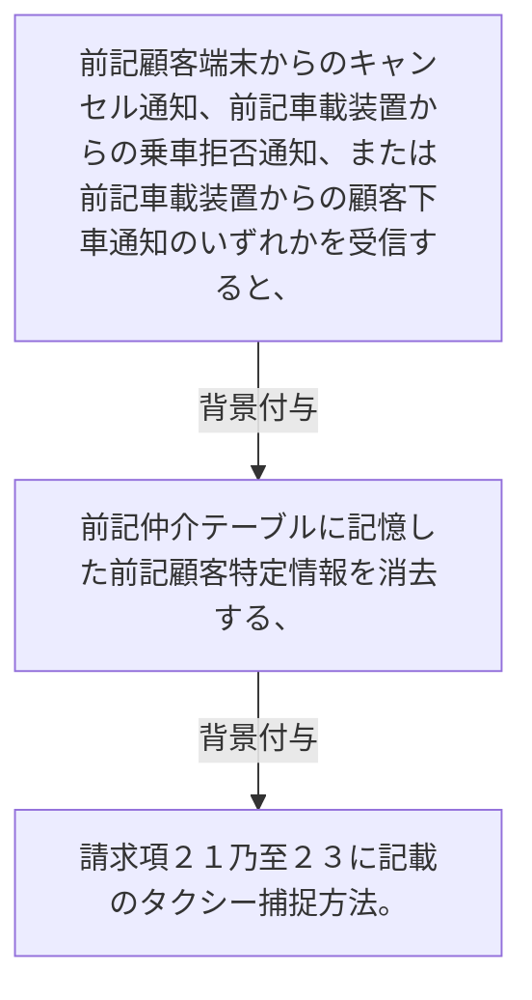

前記顧客端末からのキャンセル通知、前記車載装置からの乗車拒否通知、または前記車載装置からの顧客下車通知のいずれかを受信すると、前記仲介テーブルに記憶した前記顧客特定情報を消去する、請求項２１乃至２３に記載のタクシー捕捉方法。

```mermaid
flowchart TB
A[前記顧客端末からのキャンセル通知、前記車載装置からの乗車拒否通知、または前記車載装置からの顧客下車通知のいずれかを受信すると、]
B[前記仲介テーブルに記憶した前記顧客特定情報を消去する、]
C[請求項２１乃至２３に記載のタクシー捕捉方法。]
A --背景付与--> B
B --背景付与--> C
```