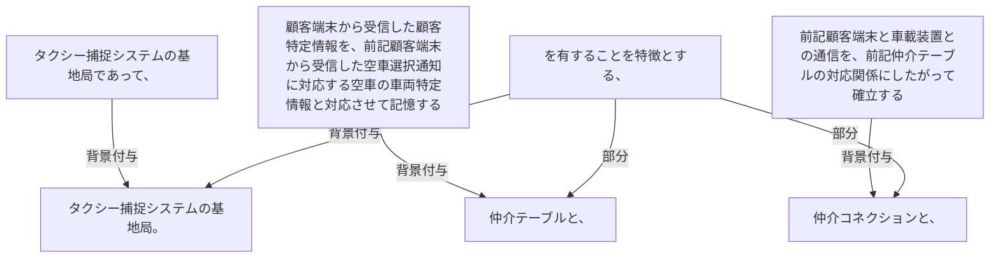

```mermaid
flowchart TB
A[タクシー捕捉システムの基地局であって、]
B[顧客端末から受信した顧客特定情報を、前記顧客端末から受信した空車選択通知に対応する空車の車両特定情報と対応させて記憶する]
C[仲介テーブルと、]
D[前記顧客端末と車載装置との通信を、前記仲介テーブルの対応関係にしたがって確立する]
E[仲介コネクションと、]
F[を有することを特徴とする、]
G[タクシー捕捉システムの基地局。]
A --背景付与--> G
B --背景付与--> C
D --背景付与--> E
F --部分--> C
F --部分--> E
F --背景付与--> G
```